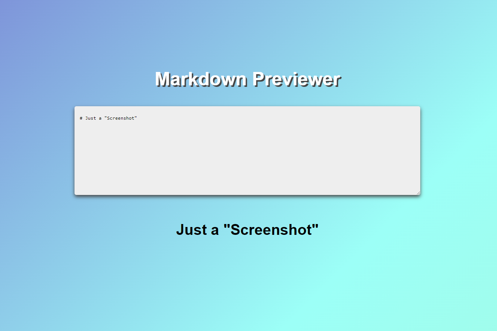

Markdown Previewer
===

Main Features:
---

* Un-marked Box
* Markdown Preview Box

**Un-marked Interactive Box**

The un-marked box start with an example, you can edit it.
You can also resize the box during your typing.

**Markdown Previewer Box**

Everything is shown below the interactive box.

Technical Features:
---

**Development**

This app is developed entirely using *React.js* with *Marked Library*.

(***Bash Scripting***)

*npm start*

Appearance:
---

**CSS Responsive & Customized**

No package, this CSS file was created only for this App.

**Appearance of the App**

